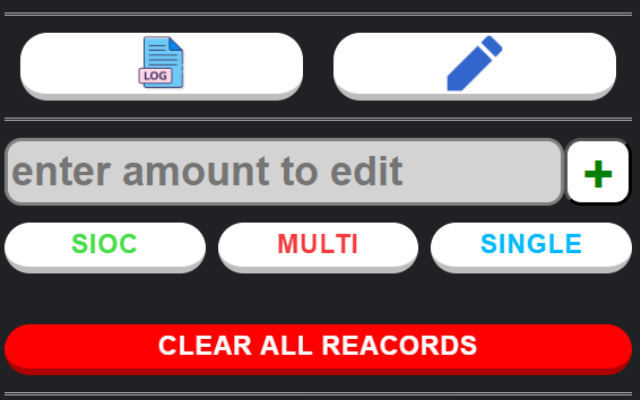
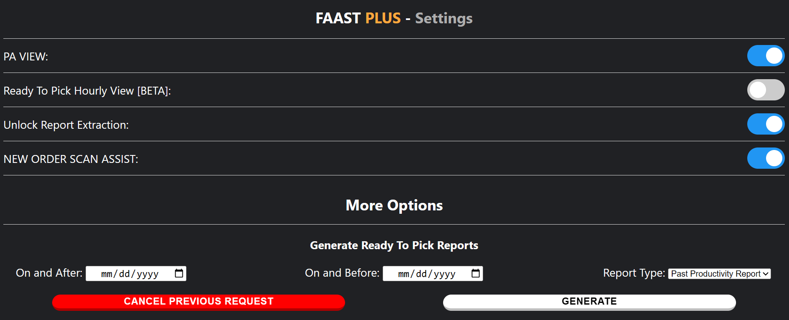

<!-- PROJECT SHIELDS -->
[![Contributors][contributors-shield]][contributors-url]
[![Forks][forks-shield]][forks-url]
[![Stargazers][stars-shield]][stars-url]
[![Issues][issues-shield]][issues-url]
[![MIT License][license-shield]][license-url]
[![LinkedIn][linkedin-shield]][linkedin-url]

<!-- PROJECT LOGO -->
 

  

<h3 align="center">Faast Plus - Chrome Extension</h3>

  

    An chrome extension thats extends the functionality of Fasst wms website.
     
    <a href="https://github.com/Musa-Kal/FaastPlus-Chrome-Extension"><strong>Explore the docs »</strong></a>
     
     
    <a href="https://github.com/Musa-Kal/FaastPlus-Chrome-Extension/issues/new?labels=bug&template=bug-report---.md">Report Bug</a>
    ·
    <a href="https://github.com/Musa-Kal/FaastPlus-Chrome-Extension/issues/new?labels=enhancement&template=feature-request---.md">Request Feature</a>
    .
    <a href="https://github.com/Musa-Kal/FaastPlus-Chrome-Extension/blob/main/CHANGELOG.md">Change Logs</a>
  

<!-- TABLE OF CONTENTS -->
<!-- 
 -->
<h2>Table of Contents</h2>
<ol>
  <li>
    <a href="#about-the-project">About The Project</a>
    <ul>
      <li><a href="#built-with">Built With</a></li>
    </ul>
  </li>
  <li>
    <a href="#getting-started">Getting Started</a>
    <ul>
      <li><a href="#chrome-web-store">Chrome Web Store</a></li>
      <li><a href="#unpacked-installation">Unpacked Installation</a></li>
    </ul>
  </li>
  <li>
    <a href="#usage">Usage</a>
    <ul>
      <li><a href="#claim-license-key">Claim / Obtain License Key</a></li>
    </ul>
  </li>
  <li><a href="#roadmap">Roadmap</a></li>
  <li><a href="#contributing">Top contributors</a></li>
  <li><a href="#license">License</a></li>
  <li><a href="#contact">Contact</a></li>
  <li><a href="#acknowledgments">Acknowledgments</a></li>
</ol>
<!-- 
 -->

<!-- ABOUT THE PROJECT -->
## About The Project

  
  
  

 

There are a lot of features that faast wms website provides but there are also some areas of the website that could be improved, and that is exactly what this project does. It improves and extends faast wms functionality and UI for Associates and P.As. The extension / project also has multiple options thats could be changed in accordance to user preferences. 

(<a href="#readme-top">back to top</a>)

### Built With

* Plain JS
* HTML
* CSS

(<a href="#readme-top">back to top</a>)

<!-- GETTING STARTED -->
## Getting Started

The methods to install and add the extension are detailed below.

### Chrome Web Store

This extension can be added to chrome browser through chrome web store.
 
[>>> Faast Plus - Chrome Web Store URL <<<][faast-plus-chrome-web-store-url]

### Unpacked Installation

For unpacked version of the extension, please contact the author.

(<a href="#readme-top">back to top</a>)

<!-- USAGE EXAMPLES -->
## Usage

Once the extension is added to the browser, it will start working out the box.

For information on how to add extension to the browser refer of the <a href="#getting-started">Getting Started</a> section.

This extension has 3 main components to it, Popup, Options Window and Content Scripts. More information about these components will be detailed below.

1. 

    
Popup

     

    Popup can be accessed by clicking on the extension icon in your browser.

    

      
      
Image of Fast Plus popup window

    

    - Popup allows user to view all the units that user has packed, view logs, edit records and access options window.

    - The detailed records in popup window only go back to last 2 days of submitted records.

    - Logs can be accessed by clicking on the view logs button. 
      

Logs Example

         
        
         
        Image of logs display section
          
        - Only logs for the last day packed are saved.
      

    - Edit records section can be shown by clicking on the edit records button. 
      

        
Edit Records Example

         
        
         
        Image of edit records section.
        
        - Only records for the last day packed can be adjusted.
        - Amount of adjustment can be entered in the input field as a number.
        - By clicking the button to the right of the input field, adjustment type can be toggled between addition and subtraction.
        - By clicking the type buttons below the input filed, request to adjust the records for that type of orders will be submitted.
        - Clear All Records button will clear all the records and logs, including the all time records.
      

  

2. 

    
Options Window 

     

    Options window can be accessed by clicking on the gear icon in the popup window.

    

      
      
Image of Fast Plus options window

    

    - Options window allows users to toggle settings based on user preferences.

    - More options section in options window allows for more custom interactions with faast wms site.
      1. Generate Ready To Pick Report: scrapes the ready to pick section based on range of 2 dates provided and generates a csv or view based on all the pick-tasks found with in that range (report type can be changed using the right most drop down under Generate "Ready To Pick Report" option). 
          - Past Productivity Report: Generates an csv containing all pick task within the date range separated by assignee.
          - Daily Productivity Report: Downloads a csv file formate similar to raw data report but includes column for last update time and generates a view for a given day under more options showing all the pick task and how long they were active for.
          - Raw Data: Generates a csv containing all useful data with in the date range in ready to pick section.

  

3. 

    
Content Scripts

     

    Content scripts run in the background of faast wms website adding new features and extending its functionality.

    1. 

          
New Order

           
          

            
            
Image of New Order section Fast Plus [P.A View].

          

          
          - This feature is only available in P.A view.
          - When an ASIN is selected in the new order section; image, weight, size classification and name of the product will be shown below the batch size input field. 

           
          

            
            
Image of New Order section ExSD time dropdown Fast Plus [P.A View].

          

          
          - This feature is only available in P.A view.
          - This feature can be toggled in options page.
          - This feature allows you to save and select time presets for ExSD in New Order section.
        

    2. 

          
Ready To Pick

           

          - 

              
A.A View / Default View

               
              

                
                
Image of Ready To Pick section with Fast Plus [A.A / Default View].

              

              
              - A table with summary of all the pick-tasks being displayed on the ready to pick section that are assigned to the logged in user will appear on top of the page. 
            

          - 

              
P.A View

               
              

                
                
Image of Ready To Pick section with Fast Plus [P.A View].

              

              
              - This feature is only available in P.A view.
              - A group of 3 numbers will appear at top of page displaying a summary of segmented lines.
              - The line with multiple segments in ready to pick section, each segments represent a share of pick-task assignee for all pick-tasks being displayed in the ready to pick section.
              - The segments are displayed in descending order.
              - A more detail view of that segment can be shown by click of the that segment.
                

                  
Segment Detail View Example

                   
                  
                   
                  Image of Segment Detail.
                  
                  - Name of the Assignee that the segment belong to will appear, with a table that contains details about that segment.
                

            

        

    3. 

          
Ready To Pack

           

          - 

              
Continue To Scan and Verify Section

               

              

                
                
Image of Continue to Scan and Verify section with Fast Plus.

              

              - A green button will appear in scan and verify section, once pressed will send a request to add total units in that pick-task to the total of appropriate type and continue the user to Scan and Verify section.
              - Request adds total to the date of the day button way clicked.

            

          - 

              
Scan and Verify Section

               

              

                
                
Image of Scan and Verify section with Fast Plus.

              

              - New Order Scan Assist setting must be turned on for this feature.
              - A table will appear under the input field displaying the total number of units with in the order and total unscanned instances of top / highlighted units.

        

        
    4. 

          
Quick Pack Section

           

          

            
            
Image of Quick Pack section section with Fast Plus.

          

          - Two buttons will appear in quick pack section, one prompting to add to SIOC and continue, and other prompting to add to singles and continue.
          - Once pressed, a request will be sent to add total orders in that pick-task to the total of the type prompted on the button clicked, and continue the user to Scan and Verify section.
          - Request adds total to the date of the day button way clicked.

      

  

### Claim License Key

<b>Why License Keys:</b>
 
Reason I went with license keys is so I can give role based access to users, and I implemented license keys in particular because I wanted minimum possible effort on users end and I didn't want users to give their credentials to create an account.

<b>How to obtain a key:</b>
 
The only way to obtain a key currently is to <a href="#contact">contact</a> the developer.

<b>What does role mean:</b>
 
Each license key has a role assigned to it, higher the role number more access the user will have. Default role without license is 0 and some features will be locked based on your role number.

<b>How to claim an license key:</b>
 
Options Page > Claim License Section > Insert Key > Press Claim License

  
  
Claim license section in Options page.

  
  
Claim license section once a license is claimed.

<ul>
  <li><b>Delete License Button:</b> pressing it will remove the license.</li>
  <li><b>SYNC License button:</b> pressing it will sync the license with the server.</li>
</ul>

 

(<a href="#readme-top">back to top</a>)

<!-- ROADMAP -->
## Roadmap

- Actively looking for feedback and new feature ideas.

See the [open issues](https://github.com/Musa-Kal/FaastPlus-Chrome-Extension/issues) for a full list of proposed features (and known issues).

(<a href="#readme-top">back to top</a>)

<!-- CONTRIBUTING -->
## Top contributors:

<!-- LICENSE -->
## License

Distributed under the MIT License. See `LICENSE.txt` for more information.

(<a href="#readme-top">back to top</a>)

<!-- CONTACT -->
## Contact

Email - musakaleem1411+github@gmail.com

LinkedIn - [https://linkedin.com/in/musa-kaleem-122249294](https://linkedin.com/in/musa-kaleem-122249294)

Project Link - [https://github.com/Musa-Kal/FaastPlus-Chrome-Extension](https://github.com/Musa-Kal/FaastPlus-Chrome-Extension)

(<a href="#readme-top">back to top</a>)

<!-- ACKNOWLEDGMENTS -->
## Acknowledgments

* [Best-README-Template](https://github.com/othneildrew/Best-README-Template.git) by Othneil Drew

(<a href="#readme-top">back to top</a>)

<!-- MARKDOWN LINKS & IMAGES -->
<!-- https://www.markdownguide.org/basic-syntax/#reference-style-links -->
[faast-plus-chrome-web-store-url]: https://chromewebstore.google.com/detail/faast-plus/lejbdnbbnibjjfjkffhkjmcligdccoej?pli=1
[contributors-shield]: https://img.shields.io/github/contributors/Musa-Kal/FaastPlus-Chrome-Extension.svg?style=for-the-badge
[contributors-url]: https://github.com/Musa-Kal/FaastPlus-Chrome-Extension/graphs/contributors
[forks-shield]: https://img.shields.io/github/forks/Musa-Kal/FaastPlus-Chrome-Extension.svg?style=for-the-badge
[forks-url]: https://github.com/Musa-Kal/FaastPlus-Chrome-Extension/network/members
[stars-shield]: https://img.shields.io/github/stars/Musa-Kal/FaastPlus-Chrome-Extension.svg?style=for-the-badge
[stars-url]: https://github.com/Musa-Kal/FaastPlus-Chrome-Extension/stargazers
[issues-shield]: https://img.shields.io/github/issues/Musa-Kal/FaastPlus-Chrome-Extension.svg?style=for-the-badge
[issues-url]: https://github.com/Musa-Kal/FaastPlus-Chrome-Extension/issues
[license-shield]: https://img.shields.io/github/license/Musa-Kal/FaastPlus-Chrome-Extension.svg?style=for-the-badge
[license-url]: https://github.com/Musa-Kal/FaastPlus-Chrome-Extension/blob/master/LICENSE.txt
[linkedin-shield]: https://img.shields.io/badge/-LinkedIn-black.svg?style=for-the-badge&logo=linkedin&colorB=555
[linkedin-url]: https://linkedin.com/in/musa-kaleem-122249294
